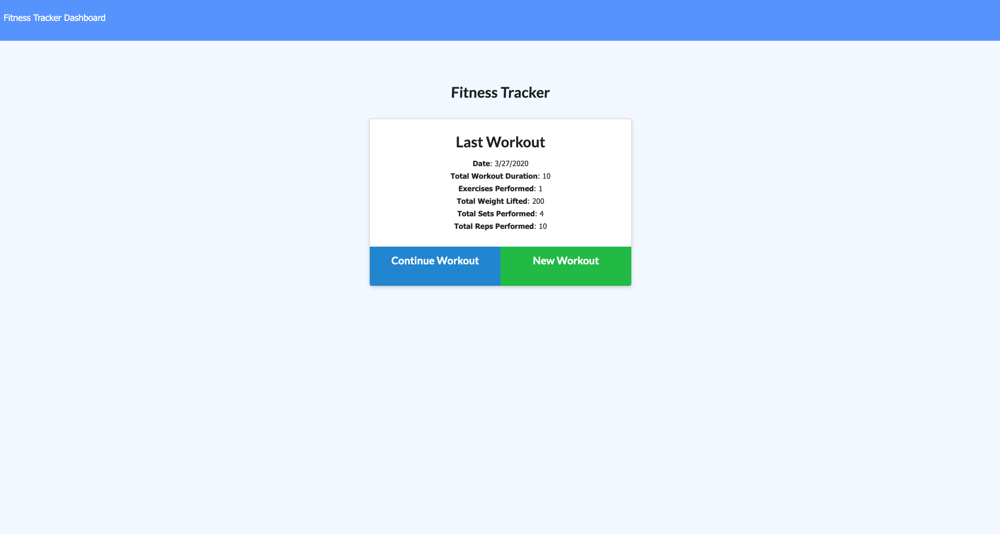
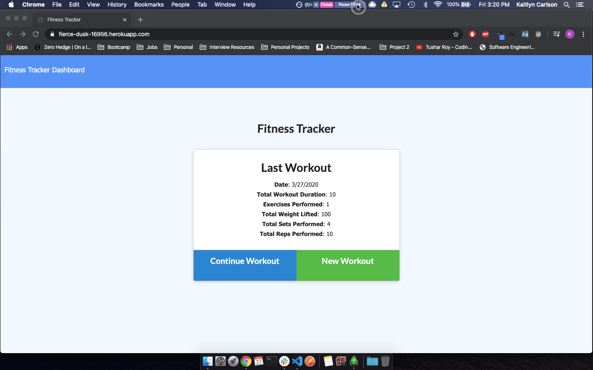

# Workout Tracker



Checkout the deployed application today:
[Workout Tracker](https://fierce-dusk-16956.herokuapp.com/)

## Overview

For this assignment the front end code was provided as is.

It was my job to build the back-end of this application. In order to build a functional back end I had to create a Mongo database with a Mongoose schema and handle routes with Express.

## Table of Contents

- [Purpose](#Purpose)
- [Functionality](#Functionality)
- [Technologies](#Technologies)
- [Known Bugs](#Known-Bugs)

## Purpose

The user story that defines this product's intent and usability is as follows:

```
As a user, I want to be able to view create and track daily workouts. I want to be able to log multiple exercises in a workout on a given day. I should also be able to track the name, type, weight, sets, reps, and duration of exercise. If the exercise is a cardio exercise, I should be able to track my distance traveled.
```

## Functionality

An example interaction of a user creating a workout and then adding an exercise to it is displayed in the provided giph below:



Perhaps the most important part of this application is the **Models**. It enables Mongoose to interact with our MongoDB. This is the foundation for each workout creation, and exercise updates. The front end enables the addition of exercises to be fairly user-proof so all we need is a Workout model with a field for the day as well as exercises. This field for day is handled entirely on the back end for the user. The exercises are where we flesh out the different types of nested keys and expected input types. The front end elimiates user error for these input fields so we don't need to worry about invalid input handling.

As you will see below I utilized a virtual on the WorkoutSchema in order to create a custom property on the schema which would automatically generate the total duration of each workout's exercises. By utilizing a virtual- as opposed to a method which would act like a function, a property is created- just like the day and exercises properties, for both efficiency and ease of access.

So, our workout model looks like this:

```js
const mongoose = require(`mongoose`);
const Schema = mongoose.Schema;
const WorkoutSchema = new Schema(
  {
    day: {
      type: Date,
      default: Date.now,
      unique: true
    },
    exercises: [
      {
        type: {
          type: String,
          trim: true,
          required: "Type of exercise is required."
        },
        name: {
          type: String,
          trim: true,
          required: "Name of exercise is required."
        },
        weight: {
          type: Number
        },
        sets: {
          type: Number
        },
        reps: {
          type: Number
        },
        duration: {
          type: Number,
          required: "Duration (minutes) of exercise is required."
        },
        distance: {
          type: Number
        }
      }
    ]
  },
  {
    toJSON: {
      virtuals: true
    }
  }
);
WorkoutSchema.virtual("totalDuration").get(function() {
  return this.exercises.reduce((total, exercise) => {
    return total + exercise.duration;
  }, 0);
});
module.exports = mongoose.model(`Workout`, WorkoutSchema);
```

Users can also view the stats on their past 10 workouts as displayed below.


In order to display only the last 10 exercises performed by a user the API route needed to first organize the workouts in descending order by day, and then to slice the first 10 data points from the array.

This is accomplished in the following code which can be found in ./routes/api-routes.js:

```js
app.get(`/api/workouts/range`, (req, res) => {
  db.Workout.find({})
    .sort({ day: -1 })
    .then(dbWorkout => {
      res.json(dbWorkout.slice(0, 10));
    })
    .catch(err => {
      res.json(err);
    });
});
```

## Technologies

- MongoDB
- Mongoose
- Express
- ChartJS

## Known Bugs

It is possible that users can create an error in this application. If a user continually adds to a workout and upon their last addition selects "Add Exercise" and then clicks "Complete" a bug occurs.
The selection of "Complete" at this point submits an exercise with empty strings as the "Add Exercise" was selected first. The front end should account for this and the PUT should be removed from the "Complete" button events. "Add Exercise" should be the only button with a PUT request.
