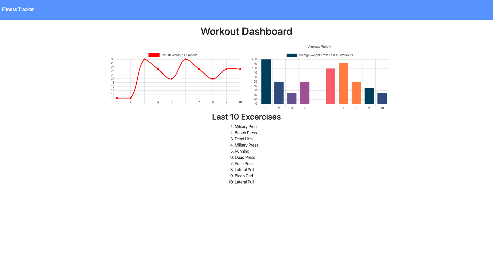

# Workout Tracker


Checkout the deployed application today:
[Workout Tracker](https://fierce-dusk-16956.herokuapp.com/)

## Overview

For this assignment the front end code was provided as is.

It was my job to build the back-end of this application. In order to build a functional back end I had to create Mongo database with a Mongoose schema and handle routes with Express.

## Table of Contents

- [Purpose](#Purpose)

- [Functionality](#Functionality)
- [Technologies](#Technologies)

## Purpose

The user story that defines this product's intent and usability is as follows:

```
As a user, I want to be able to view create and track daily workouts. I want to be able to log multiple exercises in a workout on a given day. I should also be able to track the name, type, weight, sets, reps, and duration of exercise. If the exercise is a cardio exercise, I should be able to track my distance traveled.
```

## Functionality

An example interaction of a user creating a workout and then adding an exercise to it is displayed in the provided giph below:


Users can also view the stats on their past 10 workouts as displayed below.



In order to display only the last 10 exercises performed by a user the API route needed to first organize the workouts in descending order by day, and then to slice the first 10 data points from the array.

This is accomplished in the following code which can be found in ./routes/api-routes.js:

```js
app.get(`/api/workouts/range`, (req, res) => {
  db.Workout.find({})
    .sort({ day: -1 })
    .then(dbWorkout => {
      res.json(dbWorkout.slice(0, 10));
    })
    .catch(err => {
      res.json(err);
    });
});
```

## Technologies

- MongoDB
- Mongoose
- Express
- ChartJS
- Bootstrap
